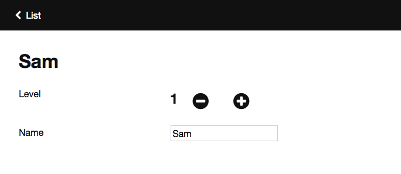

> This tutorial has been upgraded from Hop 2.1 to Hop 3.0 on 20-03-2016, if you started the Routing chapter before that please review from the back to the beginning of the chapter.

# Navigation from Edit to List

Finally, let's add a back to list button to the edit view.


## Actions

Add an `ListPlayers` action to __src/Players/Actions.elm__:

```elm
    ...
    | EditPlayer PlayerId
    | ListPlayers
```

## Players Edit

In __/src/Players/Edit.elm__:

Add one more import:

```elm
import Html.Events exposing (onClick)
```

Add a new function at the end for the list button:

```elm
listBtn : Signal.Address Action -> ViewModel -> Html.Html
listBtn address model =
  button
    [ class "btn regular"
    , onClick address ListPlayers
    ]
    [ i [ class "fa fa-chevron-left mr1" ] [], text "List" ]
```

Here we send the `ListPlayers` when the button is clicked.

And add this button to the list, change the `nav` function to:

```elm
nav : Signal.Address Action -> ViewModel -> Html.Html
nav address model =
  div
    [ class "clearfix mb2 white bg-black p1" ]
    [ listBtn address model ]
```

## Players Update

Players Update needs to respond to the `ListPlayers` action. In __src/Players/Update.elm__ add one more branch to the case expression:

```elm
update action model =
  case action of
    ...
    ListPlayers ->
      let
        path =
          "/players"
      in
        ( model.players, Effects.map HopAction (navigateTo path) )
    ...
```

## Try it



Refresh the browser and go to the edit view. You should see the list button at the top. Clicking this button will change the location to `/players`.

At this moment your application code should look like <https://github.com/sporto/elm-tutorial-app/tree/075-navigation-to-list>.
