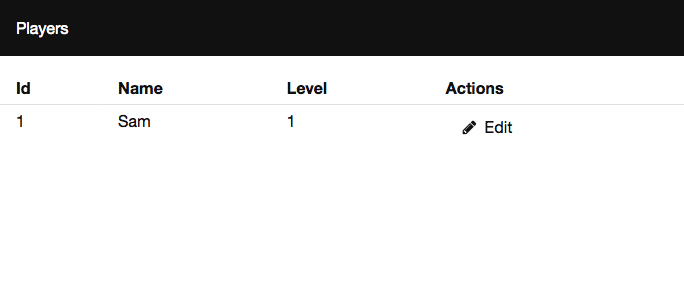

# Navigation from List to Edit

Next let's add an "Edit" button to the players' list.

## EditPlayer action

Change __src/Players/Actions.elm__ to include two new actions:

```elm
...

module Players.Actions (..) where

import Players.Models exposing (PlayerId)
import Hop


type Action
  = NoOp
  | HopAction ()
  | EditPlayer PlayerId
```

We added:

- import for Players.Models
- import Hop
- `HopAction ()` this will be used when triggering a location change
- `EditPlayer` action that will trigger when the user hits the edit player button


## Players List

The players' list needs to show a button for each player that triggers this action.

In __src/Players/List.elm__. Make sure we are importing `onClick`:

```elm
import Html.Events exposing (onClick)
```

Add a new function for this button at the end:

```elm
editBtn : Signal.Address Action -> Player -> Html.Html
editBtn address player =
  button
    [ class "btn regular"
    , onClick address (EditPlayer player.id)
    ]
    [ i [ class "fa fa-pencil mr1" ] [], text "Edit" ]
```

Here we trigger `EditPlayer` with the id of the player that we want to edit. To do this we send the `EditPlayer` with the use id to the address.

And change `playerRow` to include this button:

```elm
playerRow : Signal.Address Action -> ViewModel -> Player -> Html.Html
playerRow address model player =
  tr
    []
    [ td [] [ text (toString player.id) ]
    , td [] [ text player.name ]
    , td [] [ text (toString player.level) ]
    , td
        []
        [editBtn address player]
    ]
```

## Players Update

Finally, __src/Players/Update.elm__ needs to respond to this action. Add a new import:

```elm
import Hop
```

And add two new branches to the case expression:

```elm
update : Action -> UpdateModel -> ( List Player, Effects Action )
update action model =
  case action of
    EditPlayer id ->
      let
        path =
          "/players/" ++ (toString id) ++ "/edit"
      in
        ( model.players, Effects.map HopAction (Hop.navigateTo path) )

    HopAction _ ->
      ( model.players, Effects.none )

    NoOp ->
      ( model.players, Effects.none )
```

`Hop.navigateTo path` returns an effect. When this effect is run by Elm the location of the browser will change. You can read more about how this works [here](https://github.com/sporto/hop).

We also have to handle `HopAction` because we are wrapping the __Hop__ effect with it. After the location changes we will receive a `HopAction` with a payload, but we don't need to do anything with this here.

## Test it



Go to the list `http://localhost:3000/#/players`. You should now see an Edit button, upon clicking it the location should change to the edit view.

Up to this point your application should look like <https://github.com/sporto/elm-tutorial-app/tree/070-navigation>
