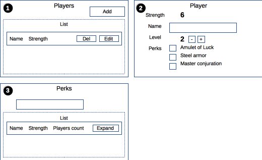

# Planning

We will build an application that tracks an imaginary roll playing game, this game will have __playes__ and __perks__ that can be associated with each player. 

This application will demonstrate:

- Multiple views
- Nested components
- Breaking the application into resources
- Routing
- Shared state accross the application
- State specific to a component
- Editing
- Validations
- Ajax requests

### Resources

During the rest of this guide I will use the word __resources__ to refer to models that are the subject of our application. These are __players__ and __perks__. Using the word __model__ can be confusing because component specific state is also a model (for example the expanded / collapse state of a component).

## Wireframes:

The application will have three views:

### Screen 1

Will show a list of players, from here you can add, delete or edit a player.

This demonstrates:

- Views and sub views
- Routing
- CRUD operations
- Resource organisation

### Screen 2

Shows the edit view for a player. In this screen you can:

- Change the name
- Change the level
- Add or remove perks

This screen demonstrates:

- Editing a resource
- Adding / removing associations between resources

### Screen 3

Show a list of all available perk. In this screen you can search for a perk, see how many players have this perk and expand the details of a perk.

This screen demonstrates:

- Search using the router
- Filtering
- Keeping component specific state (Expand / Collapse buttons)