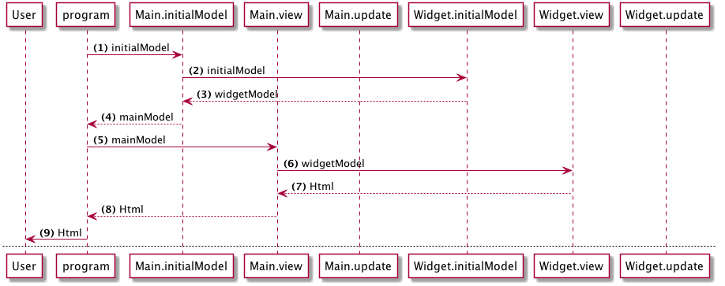

> This page covers Elm 0.18

# Composing

Here are two diagrams that illustrate this architecture:

### Initial render

(1) __program__ calls __Main.initialModel__ to get the initial model for the application

(2) __Main__ calls __Widget.initialModel__

(3) __Widget__ returns its initial model

(4) __Main__ returns a composed main model which includes the widget model

(5) __program__ calls __Main.view__, passing the __main model__

(6) __Main.view__ calls __Widget.view__, passing the __widgetModel__ from the main model

(7) __Widget.view__ returns the rendered Html to __Main__

(8) __Main.view__ returns the rendered Html to __program__

(9) __program__ renders this to the browser.

---

### User interaction

(1) User clicks on the increase button

(2) __Widget.view__ emits an __Increase__ message which is picked up by __Main.view__.

(3) __Main.view__ tags this message so it becomes (WidgetMsg Increase) and it is sent along to __program__

(4) __program__ calls __Main.update__ with this message and the main model

(5) As the message was tagged with __WidgetMsg__, __Main.update__ delegates the update to __Widget.update__, sending along the way the __widgetModel__ part of the main model

(6) __Widget.update__ modifies the model according to the given message, in this case __Increase__. And returns the modified __widgetModel__ plus a command

(7) __Main.update__ updates the main model and returns it to __program__

(8) __program__ then renders the view again passing the updated main model

---

Again, don't reach for this initially as a way to organise your application as "components". If you do this too soon you will end up with plently of boilerplate.
