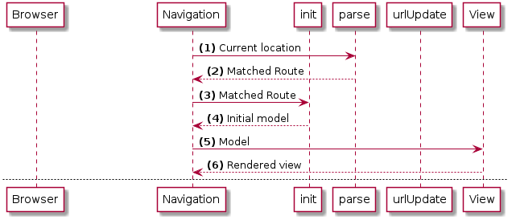

# Introduction au routage

Ajoutons le routage à notre application. Nous utiliserons les paquets [Elm Navigation package](http://package.elm-lang.org/packages/elm-lang/navigation/) et [UrlParser](http://package.elm-lang.org/packages/evancz/url-parser/).

- Navigation permet de changer l'adresse du navigateur et de répondre aux changements
- UrlParser permet de faire correspondre des routes à des actions

D'abord, installez les paquets :

```bash
elm package install elm-lang/navigation 1.0.0
elm package install evancz/url-parser 1.0.0
```

 `Navigation` est une bibliothèque qui enveloppe `Html.App`. Elle a toutes les fonctionnalités de `Html.App` mais permet en plus :

 - d'écouter les changements d'adresse du navigateur
 - d'appeler les fonctions que nous fournissons lorsque l'adresse change
 - de changer l'adresse du navigateur

## Processus

Voilà quelques diagrammes pour illustrer le fonctionnement de notre routage.

### Affichage initial



1. Quand la page se charge pour la première fois, le module `Navigation` va récupérer l'URL actuelle et l'envoyer à la fonction `parse` que nous fournissons.
1. Cette fonction `parse` va retourner une `Route` qui correspond.
1. `Navigation` va envoyer cette `Route` a la fonction `init` de notre application.
1. Dans `init`, nous créons le modèle de l'application et y stockons la `Route`.
1. `Navigation` envoie ensuite le modèle initial à la vue pour afficher l'application.

### Quand l'adresse change


1. Quand l'adresse du navigateur change, la bibliothèque `Navigation` reçoit un événement.
1. La nouvelle adresse est envoyée à notre fonction `parse`, comme précédemment.
1. `parse` renvoie la `Route` correspondante.
1. `Navigation` appelle alors la fonction `urlUpdate` que l'on fournit à la `Route`.
1. Dans `urlUpdate`, on enregistre la `Route` dans le modèle de l'application et l'on retourne le modèle mis à jour
1. `Navigation` affiche l'application, comme d'habitude.
