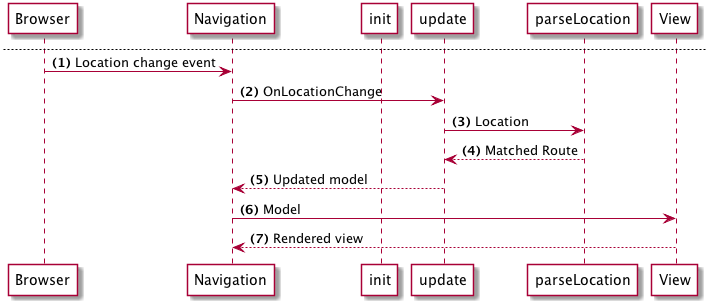

> This page covers Elm 0.18

# ルーティングの紹介

アプリケーションにルーティングを追加しましょう。 [Elm Navigation package](http://package.elm-lang.org/packages/elm-lang/navigation/)と[UrlParser](http://package.elm-lang.org/packages/evancz/url-parser/)を使用します。

- ナビゲーションはブラウザの場所を変更し、変更に対応する手段を提供します
- UrlParserはルートマッチャーを提供します

最初にパッケージをインストールします。

```bash
elm package install elm-lang/navigation 1.0.0
elm package install evancz/url-parser 1.0.0
```

`Navigation`は`Html.program`をラップするライブラリです。 `Html.program`のすべての機能といくつかの余分な機能を備えています：

 - ブラウザ上でのロケーションの変更を待ち受る
 - 場所が変更されたときにメッセージをトリガする
 - ブラウザの場所を変更する方法を提供する

## フロー

ルーティングの仕組みを理解するための図をいくつか示します。

### 初期レンダリング


(1) ページが最初に読み込まれるとき、 `Navigation`モジュールは現在の`Location`を取得し、それをアプリケーションの`init`関数に送ります。
(2) `init`関数中でこのlocationをパースし一致する`Route`を得ます。
(3,4) 一致した `Route`をアプリケーションの初期モデルに保存し、このモデルを`Navigation`に返します。
(5,6) この初期モデルを送ることで`Navigation`はビューをレンダリングします。

### ロケーションが変更されたとき



(1) ブラウザの閲覧ロケーションが変更されると、ナビゲーション・ライブラリーはイベントを受け取ります
(2) `OnLocationChange`メッセージが` update`関数に送られます。このメッセージには新しい`Location`が含まれます。
(3,4) `update`では、 `Location`を解析し、一致する`Route`を返します。
(5) `update`からアップデート`Route`を含む更新されたモデルを返します。
(6,7) `Navigation`は、アプリケーションを通常通りレンダリングします
