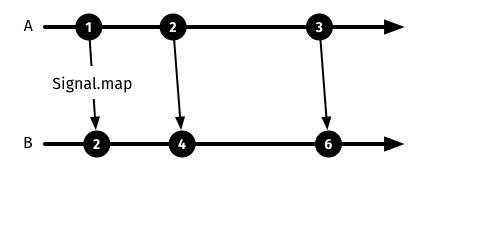

# Introduction to signals

In Elm, __signals__ are one of the basic building blocks for creating applications. You can think of as a signal as a stream of values that change over time.

Signals can be merged, transformed and filtered as you see fit.


Let's see a basic signal:

```elm
module Main (..) where

import Html
import Mouse


view : Int -> Html.Html
view x =
  Html.text (toString x)


main : Signal.Signal Html.Html
main =
  Signal.map view Mouse.x
```

<https://github.com/sporto/elm-tutorial-assets/blob/master/signals/BasicMouse.elm>

If you run this example in the browser you will see the changing `x` coordinate as you move your mouse.

In the first line we import the `Html` module from core, which we will use to display the `x` coordinate.

In the second line we import `Mouse` from core. This module has various utilities for working with the mouse.

#### view

`view` is a function that takes an integer and returns an html fragment (`Int -> Html.Html`).

But `Html.text` takes a string, so we need to convert `x` to a string first. This is done with the `toString` function.

#### main

In Elm applications `main` can return a __static element__ or a __signal__. In this case `main` is returning a signal of Html (`Signal.Signal Html.Html`). That is, the HTML output by this application can vary over time!

To understand how this is accomplished, let us deconstruct the last line of the code above (`Signal.map view Mouse.x`).

#### Mouse.x

`Mouse.x` gives us a signal of your mouse `x` coordinate as it changes. This signal has the signature `Signal.Signal Int`, so it is a signal that carries an integer.

#### Signal.map

`Signal.map` is a function that __converts__ or __maps__ one signal to a different signal.

Its type signature is `Signal.map : (a -> result) -> Signal a -> Signal result`.

- The first argument is a function that receives a value of type `a` and outputs a value of type `result`. This functions converts values from the source signal to values for the output signal.
- The second argument to `Signal.map` is the source signal, i.e. the signal to be transformed.  It has to be a signal of values of type `a`.
- The output has the type `Signal result`. That is, it is a signal of values of type `result`.



__Diagram__: We have a source signal (A). Signal.map produces a second signal (B). This second signal produces values that are the double of the original signal.

---

Going back to our example:

```elm
Signal.map view Mouse.x
```

In the example above, the `view` function is used as the transformation or mapping function. It takes an `Int` value and outputs `Html.Html`.

The second argument (`Mouse.x`) is a signal of `Int` values. So the output is a signal of `Html.Html` values.  Which is what we want the function `main` to output.

`Signal.map` returns a new signal with the result of mapping the values of the source signal through the provided transformation function. As the source signal changes, each new value is transformed into, or mapped to, a value of the target signal type.

---

Here is another example of map:

```elm
double x =
  x * 2

doubleSignal =
  Signal.map double Mouse.x
```

`double` is a function that doubles the input. So `doubleSignal` is a signal that gives us the current mouse x coordinate multiplied by 2.

### Exercise

Try combining the basic mouse `x` coordinate example above with `doubleSignal` so you see the current `x` multiplied by 2 as you move your mouse.
