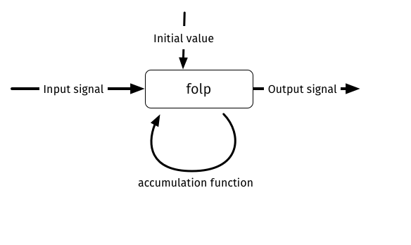

# Keeping state

In the previous section, we created a little application that displays the current mouse x coordinate. In it,  the current state was discarded as input values were received. But in most web applications we want to store some state as the user interacts with the application.

Let's create an application that tracks clicks.

```elm
module Main (..) where

import Html
import Mouse


view : Int -> Html.Html
view count =
  Html.text (toString count)


countSignal : Signal Int
countSignal =
  Signal.map (always 1) Mouse.clicks


main : Signal.Signal Html.Html
main =
  Signal.map view countSignal
```

<https://github.com/sporto/elm-tutorial-assets/blob/master/signals/Clicks.elm>

To introduce things gradually, here is an application that shows `1` all the time.

The `view` function displays the given count, but in this case it is always 1.

The `countSignal` function produces a signal of integers. As its input, it takes the `Mouse.clicks` signal and maps it to `(always 1)`.

`main` takes this `countSignal` and maps it through the `view` function.

## Signal.foldp

`Signal.foldp` for 'fold past' is a signal that takes past state and combines it with a current input. It is similar to `reduce` in JavaScript arrays.

Here is the application using `foldp`:

```elm
module Main (..) where

import Html
import Mouse


view : Int -> Html.Html
view count =
  Html.text (toString count)


countSignal : Signal Int
countSignal =
  Signal.foldp (\_ state -> state + 1) 0 Mouse.clicks


main : Signal.Signal Html.Html
main =
  Signal.map view countSignal
```

<https://github.com/sporto/elm-tutorial-assets/blob/master/signals/ClicksWithFoldp.elm>

Let's see what happens on the `Signal.foldp` line.

`Signal.foldp` takes three arguments:

- An __accumulation__ function: `(\_ state -> state + 1)`
- The __initial state__, in this case `0`
- And the __input signal__: `Mouse.clicks`

The syntax `\x y -> x + y` is an anonymous function. It is equivalent to `(x, y) => x + y` in ES6.

#### How `foldp` works



- Each time `foldp` receives an __input signal__ it will call the __accumulation__ function.
- This __accumulation__ function receives the output of the __input signal__ and the __previous state__.
- The first time `foldp` receives an __input signal__ it will pass the __initial state__ as previous state to the __accumulation__ function.
- The __accumulation__ function calculates and returns a new state.
- `foldp` keeps this new state and passes it as the previous state the next time it calls the __accumulator__ function.
- Finally, `foldp` produces an __output signal__.


#### The accumulation function

```elm
\_ state -> state + 1
```

The __accumulation__ function above takes the input from `Mouse.clicks` and the previous state and returns a new state.

The input from `Mouse.clicks` is always `()` which is called the unit type in Elm. We don't need to do anything with this value, so we ignore it by using `_`.

As mentioned an empty tuple `()` in Elm is called the unit type. Read more about it [here](http://stackoverflow.com/questions/33949145/what-do-the-empty-parentheses-mean-in-elm).
