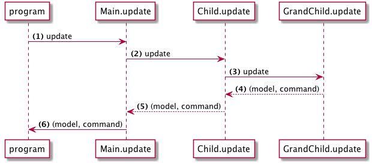

# 命令（Commands）

Elm 中，命令（Cmd）是用來告訴執行期（runtime）如何執行副作用（side effects）。例如：

- 產生一組隨機數字
- 發送 http 請求
- 儲存某些東西到 local storage

`Cmd` 可以是一個或多個要做的事情。我們使用命令聚集所有要發生的事情，交給執行期。接著執行期將會執行它們並將結果提供回應用程式。

換句話說，如同 Elm，函數式語言的每個函式都傳回一個值。語言設計的傳統思維中，函式是禁止產生副作用的，Elm 用替代方式來模塑（modeling）它。本質上，函式傳回一個命令值（command value），給予期望作用一個名稱。由於 Elm 的架構，主要的 Html.App 程式，是命令值最終的收件人。Html.App 程式的更新函式，包含了如何執行該名稱命令的邏輯。

讓我們用一個範例來試試命令：

```elm
module Main exposing (..)

import Html exposing (Html, div, button, text)
import Html.Events exposing (onClick)
import Html.App
import Random


-- 模型


type alias Model =
    Int


init : ( Model, Cmd Msg )
init =
    ( 1, Cmd.none )


-- 訊息


type Msg
    = Roll
    | OnResult Int


-- 視界


view : Model -> Html Msg
view model =
    div []
        [ button [ onClick Roll ] [ text "Roll" ]
        , text (toString model)
        ]


-- 更新


update : Msg -> Model -> ( Model, Cmd Msg )
update msg model =
    case msg of
        Roll ->
            ( model, Random.generate OnResult (Random.int 1 6) )

        OnResult res ->
            ( res, Cmd.none )


-- 主程式


main : Program Never
main =
    Html.App.program
        { init = init
        , view = view
        , update = update
        , subscriptions = (always Sub.none)
        }
```

如果你執行了應用程式，它會顯示一個按鈕，當你點擊後會產生一個隨機的數字。

---

讓我們回顧相關部份：

### 訊息

```elm
type Msg
    = Roll
    | OnResult Int
```

我們應用程式裡有兩個訊息。`Roll` 表示骰出新數字。`OnResult` 表示從 `Random` 函式庫取得產生出來的結果。

### 更新

```elm
update : Msg -> Model -> ( Model, Cmd Msg )
update msg model =
    case msg of
        Roll ->
            ( model, Random.generate➊ OnResult (Random.int 1 6) )

        OnResult res ->
            ( res, Cmd.none )
```

➊ `Random.generate` 製造一個命令，這個命令將會產生一個隨機數字。函式第一個參數必須是訊息的建構子，用來提供結果給我們的應用程式。這個例子的建構子是 `OnResult`。

所以，當命令執行，Elm 將會呼叫 `OnResult` 伴隨著產生出來的數字，例如產出 `OnResult 2`。接著 __Html.App__ 會將此訊息提供給應用程式。

如果你感到疑惑，`OnResult res` 表示一個訊息，OnResult 裝載額外的訊息，即這個例子中的整數 'res'。這種樣式也就是所謂的參數化型別（parameterized types）。

---

大型應用程式中常有許多巢狀元件，很有可能一次送出許多命令到 __Html.App__。以下列圖例為例：



這裡從三個不同階層收集命令。最後將發送這所有命令到 __Elm.App__ 執行。
