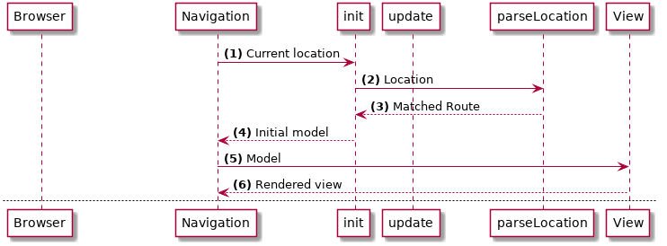

# Routing introduction

Let's add a routing to our application. We will be using the [Elm Navigation package](http://package.elm-lang.org/packages/elm-lang/navigation/) and [UrlParser](http://package.elm-lang.org/packages/evancz/url-parser/).

- Navigation provides the means to change the browser location and respond to changes
- UrlParser provides route matchers

First install the packages:

```bash
elm package install elm-lang/navigation 1.0.0
elm package install evancz/url-parser 1.0.0
```

 `Navigation` is a library that wraps `Html.App`. It has all the functionality of `Html.App` plus several extra things:

 - Listens for location changes on the browser
 - Calls functions that we provide when the location changes
 - Provides a way of changing the browser location

## Flow

Here are a couple of diagrams to understand how routing will work.

### Initial render



1. When the page first loads the `Navigation` module will fetch the current URL and send it to a `parse` function that we will provide.
1. This `parse` function will return a `Route` that matches.
1. Navigation then sends this matched `Route` to our application `init` function.
1. In `init` we create the application model, we store the matched route there.
1. Navigation then sends the initial model to the view to render the application.

### When the location changes


1. When the browser location changes the Navigation library receives an event
1. The new location is send to our `parse` function as before
1. `parse` returns the matched route
1. `Navigation` then calls a `urlUpdate` function that we provide passing the matched route
1. In `urlUpdate` we store the matched route in the application model and return the update model
1. Navigation then renders the application as normal


